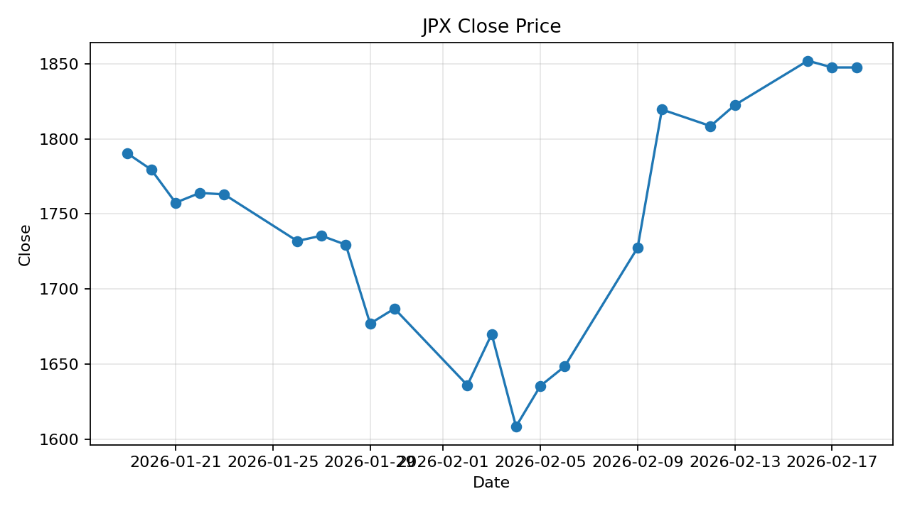
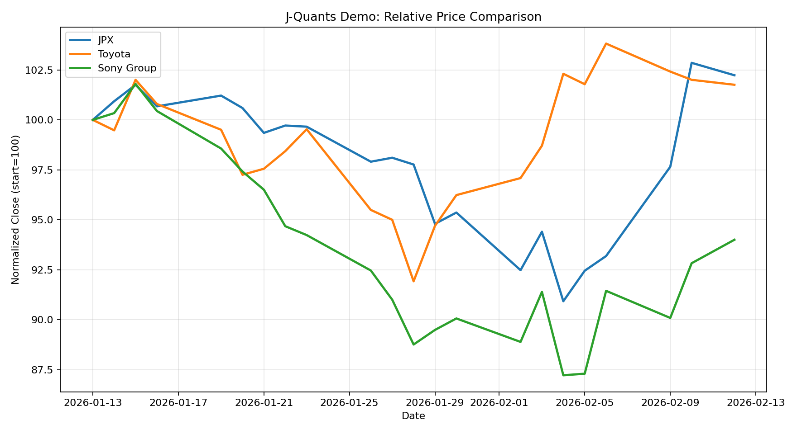

# jquants-demo

J-Quants API v2 を使った standalone の株価取得デモです。  
このディレクトリだけでセットアップして、そのまま実行できます。

含まれるサンプル:

- `first_sample.py`
  1 銘柄だけを取得する Quickstart 風の最小例
- `comparison_sample.py`
  3 銘柄の終値推移を比較する少し長めの例

## 前提条件

- Python 3.13 系
- インターネット接続
- J-Quants の API キー
- `matplotlib` の `show()` を使える GUI 環境

## セットアップ

```bash
cd jquants-demo
python -m venv .venv
```

PowerShell:

```powershell
.\.venv\Scripts\Activate.ps1
pip install -r requirements.txt
copy .env.sample .env
```

bash:

```bash
source .venv/bin/activate
pip install -r requirements.txt
cp .env.sample .env
```

`.env` に API キーを設定してください。

```env
JQUANTS_API=your_jquants_api_key
```

## ファイル構成

```text
jquants-demo/
├── .env.sample
├── .gitignore
├── README.md
├── img/
├── requirements.txt
├── first_sample.py
├── comparison_sample.py
└── results/
```

## 使い方

### 最小サンプル

```bash
python first_sample.py
```

内容:

- JPX (`86970`) の株価四本値を取得
- 無料プランの遅延を考慮して、`to` は今日の 12 週間前
- `from` はその 1 か月前の同日
- JSON を標準出力に表示
- `results/close_chart.png` を保存
- 終値グラフを表示

### 比較サンプル

```bash
python comparison_sample.py
```

対象銘柄:

- JPX (`86970`)
- Toyota (`72030`)
- Sony Group (`67580`)

内容:

- 各銘柄の価格データを取得
- 期間騰落率などを標準出力に表示
- `results/jquants_comparison.png` を保存
- 比較チャートを表示

## 成果物の例

`img/` には README 表示用のサンプル画像を置いています。  
実行時に生成される最新画像は `results/` に出力されます。

### `first_sample.py` の出力例



### `comparison_sample.py` の出力例



## 注意事項

- `.env` は各スクリプトと同じディレクトリから読み込みます。
- 無料プランでは直近データが取得できないため、日付帯は少し過去へずらしています。
- GUI がない環境では `plt.show()` が使えません。その場合は保存された PNG を見てください。
